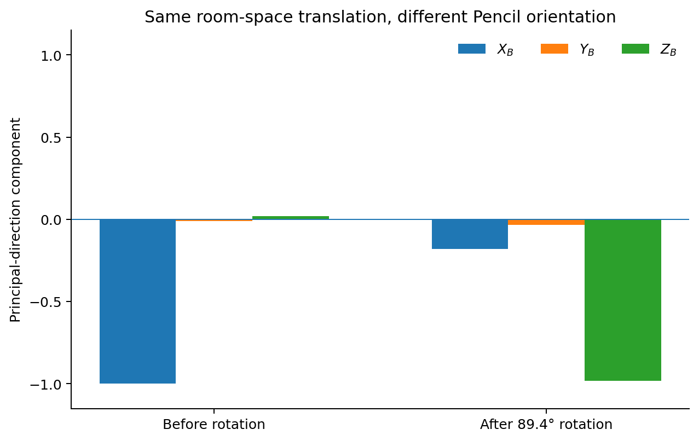
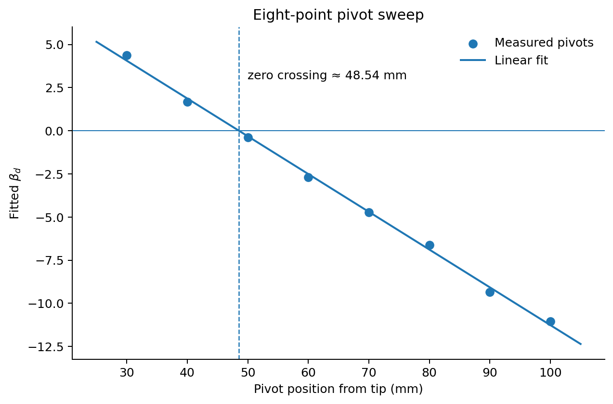

# Reverse engineering Apple Pencil Pro motion telemetry

I was working on using a pen's inertial motion to reconstruct its trajectory when I started wondering whether I needed a separate IMU at all.

Apple Pencil Pro already has enough internal sensing to support features like barrel roll and squeeze. I did not know how much of that data actually crossed the Bluetooth link, or whether it was usable outside Apple's own stack, but it seemed worth checking before building more hardware around the problem.

I ended up getting much further on the sensor side than I expected.

The Pencil was transmitting a roughly 100 Hz fused motion stream containing orientation, angular velocity, and gravity-compensated linear acceleration. I could work out its coordinate system, calibrate the gyro scale, and even estimate the physical IMU position at about 48.5 mm behind the tip.

The part I could not make work was getting that same stream into a normal iPad application.

## Starting from PacketLogger

I installed Apple's Bluetooth logging profile on the iPad, connected it to my Mac, and captured the Pencil traffic with PacketLogger.

This was convenient because I did not need to understand the application-facing API first. I could start with a simpler question: what does the iPad itself receive from the Pencil?

A reconnect capture exposed a standard HID-over-GATT layout. The relevant service was:

```text
Human Interface Device Service
UUID: 0x1812
```

and the report characteristics were standard HID Report characteristics:

```text
UUID: 0x2A4D
```

In that connection I saw these input reports:

| Observed ATT value handle | Report ID | Type  |
| :---: | :---: | :---: |
|                  `0x0037` |         0 | Input |
|                  `0x003B` |         1 | Input |
|                  `0x003F` |         8 | Input |
|                  `0x0043` |         5 | Input |

`0x003F` is only the ATT handle from that particular connection. It is not an identifier that should be hard-coded. The stable description is:

```text
HID service 0x1812
→ Report characteristic 0x2A4D
→ Report Reference descriptor 0x2908
→ Input Report ID 8
```

Report ID 8 was where almost all of the interesting low-level data lived.

Most reassembled report payloads started with `BD`, followed by one or more typed subrecords:

```text
BD
[type0: u8]
[type1: u8]
[payload_length: u8]
[tick: u32 LE]
[payload...]
[next subrecord...]
```

The motion record turned out to be:

```text
00 60 24
[tick: u32]
[36-byte payload]
```

I eventually settled on this layout for its payload:

| Payload offset | Size | Interpretation                          |
| :---: | :---: | ---: |
|              0 |    2 | fixed marker `88 86`                    |
|              2 |    1 | sample sequence                         |
|              3 |    4 | internal sensor timestamp               |
|              7 |    4 | zero / reserved                         |
|             11 |    6 | quaternion xyz, `3 × int16`             |
|             17 |    6 | gyro xyz, `3 × int16`                   |
|             23 |    6 | processed acceleration xyz, `3 × int16` |
|             29 |    7 | session/configuration-like tail         |

One subtlety here was PacketLogger itself. Simply searching the `.pklg` file for `00 60 24` was not enough. Records can cross HCI/L2CAP fragment boundaries, and a byte signature can also occur in unrelated captured data.

For the later calibration I only kept structurally complete records with the expected marker and session tail. That distinction mattered: a gap in a naive `.pklg` parser was not necessarily a dropped Pencil sample.

The retained captures still reproduce the timing cleanly. The common subrecord tick advances by 32 for ordinary consecutive motion samples. From real time that clock is approximately

$$
f_{\mathrm{tick}}\approx3200\ \mathrm{Hz},
$$

so one tick is about

$$
312.5\ \mu\mathrm{s}.
$$

The motion payload also contains a separate 32-bit sensor timestamp. Its median increment in the captures is about

$$
10017
$$

units per sample. Interpreting that as a microsecond-scale clock gives

$$
\Delta t\approx10.017\ \mathrm{ms},
$$

or

$$
f_s\approx99.8\ \mathrm{Hz}.
$$

There is also an 8-bit sample sequence:

```text
... FC FD FE FF 00 01 02 ...
```

which wraps normally modulo 256.

The BLE notification rate itself can be lower than 100 Hz because several motion records can be bundled into one notification. For anything involving derivatives or integration I therefore use the Pencil's internal timing, not host packet arrival time.

## The first three values looked like a quaternion

The first three signed 16-bit values in the motion payload had a particularly suggestive range.

What fit all of the normal samples was:

$$
q_x=\frac{c_x}{32768},
\qquad
q_y=\frac{c_y}{32768},
\qquad
q_z=\frac{c_z}{32768}.
$$

The missing component could then be reconstructed as

$$
q_w=
\sqrt{
1-q_x^2-q_y^2-q_z^2
}.
$$

All of the valid samples satisfied

$$
q_x^2+q_y^2+q_z^2\leq1,
$$

so I treated this as a Q15 encoding of the quaternion vector part.

There was an expected annoyance around 180-degree rotations. The stored vector part can flip sign because $q$ and $-q$ represent the same orientation.

For continuous processing I unwrap that with

$$
q_k\cdot q_{k-1}<0
\quad\Rightarrow\quad
q_k\leftarrow-q_k.
$$

At this point I still did not know which direction the quaternion transformed.

That was what the axis-rotation capture was for.

I rotated the Pencil around its physical axes, differentiated the quaternion trajectory, and compared the resulting angular velocity against the next three `int16` channels.

The convention that matched was

$$
\boxed{R_{WB}},
$$

meaning a vector expressed in Pencil body coordinates is transformed into the world/reference frame.

Using

$$
\Delta R_k
=
R_{WB,k}^{-1}R_{WB,k+1}
$$

to recover body angular velocity gave correlations against the packet gyro of roughly

$$
r_x\approx0.9999,
\qquad
r_y\approx0.9999,
\qquad
r_z\approx0.9999.
$$

I reran this against the surviving `02_axis_rotations.pklg` while writing this note. After rejecting incomplete/false record matches, I get approximately

$$
0.99985,\quad0.99992,\quad0.99993
$$

for the three axes.

That made the relationship difficult to explain as coincidence.

The regression scale also came out almost suspiciously clean. The estimated denominators were around 511–512 on all three axes. I use

$$
\boxed{
\omega_B
=
\frac{g_{\mathrm{raw}}}{512}
\ \mathrm{rad/s}
}.
$$

One count is therefore

$$
\frac{1}{512}
=
0.001953125\ \mathrm{rad/s},
$$

or about

$$
0.1119^\circ/\mathrm{s}.
$$

So by this point the packet already gave me a stable orientation and angular velocity at about 100 Hz.

The remaining three channels were less obvious.

## Is the acceleration in the Pencil frame or the room frame?

I initially had two plausible interpretations for the final three values.

They could have been acceleration expressed in a fixed world frame, which would have been convenient. Or they could have been in the rotating Pencil body frame.

I recorded a small controlled experiment specifically to separate those cases.

I held the Pencil with the tip pointing to my left and its flat face down, then moved it repeatedly left and right in the room.

For that first orientation, the principal acceleration direction was approximately

$$
[-0.9997,-0.0117,+0.0214].
$$

In other words, almost entirely raw axis 0.

I then rotated the Pencil by roughly 90 degrees and repeated the same left-right translation in the same room-space direction.

The quaternion said the two mean Pencil orientations differed by about

$$
89.4^\circ,
$$

with a rotation axis near

$$
[0.0077,\ 0.9999,\ -0.0117].
$$

After that rotation, the principal direction measured by the acceleration channels became

$$
[-0.1800,-0.0343,-0.9831].
$$

The same physical translation had effectively moved from sensor axis 0 to sensor axis 2.



When I instead transformed each acceleration sample by the decoded orientation,

$$
a_W=R_{WB}a_B,
$$

the principal directions from the two experiments aligned again in world space to within about

$$
7.6^\circ.
$$

So I settled on

$$
\boxed{
a_{\mathrm{telemetry}}=a_B
}
$$

for the coordinate system.

This experiment also helped establish the physical Pencil frame I use throughout the rest of the analysis:

```text
+X_B : tip → rear
+Y_B : flat-face normal
+Z_B : right-handed transverse direction
```

The roughly 90-degree controlled rotation above was almost exactly around raw $Y_B$, which was a useful physical check rather than just a convention chosen afterward.

## It was not a raw accelerometer

The next question was whether Apple was sending ordinary accelerometer specific force, including gravity.

I left the Pencil stationary in several different orientations.

If these channels had been raw accelerometer output, I should have seen a persistent vector with magnitude close to $g$, with its direction rotating as I changed the Pencil orientation.

Instead the values settled close to zero.

One particularly quiet window was approximately

```text
mean ≈ [-1.5, +0.1, -5.6] counts
std  ≈ [ 1.1,  1.7,  1.8] counts
```

and I can reproduce essentially the same window from the retained `01_static_orientation.pklg`.

That changed the interpretation substantially.

The useful model was now

$$
\boxed{
a_B^{\mathrm{lin}}
=
\text{processed, gravity-compensated body-frame linear acceleration}
}.
$$

So Apple was apparently already doing some orientation/fusion processing before this telemetry was emitted.

For trajectory reconstruction that was mostly good news. I would not have to estimate and subtract gravity from a noisy raw accelerometer myself.

I still did not know the acceleration scale, though.

More importantly, I did not know where inside the Pencil the acceleration was being measured.

## The position of the IMU started to matter

If the Pencil only translated, the exact sensor location would not matter much.

But pen motion contains a lot of rotation. An IMU several centimeters behind the tip sees substantial tangential and centripetal acceleration that the tip itself does not.

For a rigid body, acceleration at a point displaced by $r$ from a fixed pivot contains

$$
a
=
\alpha\times r
+
\omega\times(\omega\times r).
$$

That suggested a useful calibration experiment.

If I rotated the Pencil around known points along its body, both the unknown acceleration scale and the unknown longitudinal IMU position should appear in the same simple model.

My first attempts were fairly crude: pivoting around the tip and around points roughly 60 mm and 100 mm behind it.

Those already suggested that the sensor was somewhere around 48 mm from the tip.

I did not trust that result yet.

The setup was not exactly laboratory equipment. I was using books as an improvised support/reference and rotating the Pencil by hand. The pivot was never a perfect mechanical hinge, and a few millimeters of error would have been easy to hide in a three-point fit.

So I repeated it more systematically.

## An eight-point hand-pivot sweep

I marked pivot positions at

```text
30 mm
40 mm
50 mm
60 mm
70 mm
80 mm
90 mm
100 mm
```

from the tip and recorded rotational motion around each one.

The motion was still produced by hand. I used combinations of pitch, yaw, and roughly conical rotation rather than trying to constrain it to one axis.

Let the Pencil longitudinal axis be $e_X$.

If the sensor is at

$$
r_S=r_0e_X
$$

relative to the tip, and the pivot is at

$$
r_P=de_X,
$$

then the sensor's lever arm about that pivot is

$$
r(d)=(r_0-d)e_X.
$$

For a hypothetical one-meter lever along the Pencil axis, define

$$
u(t)
=
\alpha(t)\times e_X
+
\omega(t)\times
\left(
\omega(t)\times e_X
\right).
$$

The acceleration telemetry is in integer counts, so for each pivot position I fit

$$
c(t)
\approx
\beta_d u(t)+b.
$$

If $k_a$ is the acceleration conversion in counts per $\mathrm{m/s^2}$, then

$$
\boxed{
\beta_d=k_a(r_0-d)
}.
$$

That gives a useful prediction: $\beta_d$ should vary linearly with the physical pivot position.

The zero crossing gives the IMU position.

The slope gives the acceleration scale.

For $\alpha=\dot{\omega}$, I smoothed the 100 Hz gyro and used a symmetric derivative rather than a raw backward difference. The latter made the tangential term unnecessarily noisy and also introduced an avoidable timing shift.

The fitted values from the eight recordings were:

| Pivot position | Fitted $\beta_d$ |
| -------------: | ---------------: |
|          30 mm |           +4.369 |
|          40 mm |           +1.685 |
|          50 mm |           -0.395 |
|          60 mm |           -2.703 |
|          70 mm |           -4.738 |
|          80 mm |           -6.627 |
|          90 mm |           -9.360 |
|         100 mm |          -11.046 |

The result was much cleaner than I expected from the physical setup.

A linear fit gave

$$
\boxed{
\beta(d)
=
10.6256-218.884d
}
$$

with $d$ in meters, and

$$
\boxed{
R^2=0.99816
}.
$$

The sign change near 50 mm was especially useful. Once the pivot passes the sensor, the lever arm reverses direction, and the fitted coefficient did exactly that.



Converting each residual from the fitted line back into an equivalent pivot-position error gave:

|  Pivot | Equivalent error |
| :---: | :---: |
|  30 mm |         +1.41 mm |
|  40 mm |         -0.85 mm |
|  50 mm |         -0.35 mm |
|  60 mm |         -0.89 mm |
|  70 mm |         -0.19 mm |
|  80 mm |         +1.18 mm |
|  90 mm |         -1.31 mm |
| 100 mm |         +0.99 mm |

All eight hand-pivot experiments therefore landed within roughly

$$
\pm1.4\ \mathrm{mm}
$$

equivalent geometric error of one line.

That was the point where I became reasonably comfortable that the earlier ~48 mm result was not just an artifact of the particular motions I had made.

The zero crossing is

$$
\boxed{
r_0=48.54\ \mathrm{mm}
}.
$$

The formal regression standard error was around 0.49 mm, but I do not think that is a useful statement of the real physical uncertainty. The books, my hand, pivot clearance, and the finite radius of the Pencil all introduce systematic error that the regression does not know about.

For actual use I would take

$$
\boxed{
r_{T\rightarrow S}
\approx
[0.0485,0,0]^T\ \mathrm{m}
}
$$

and attach a longitudinal uncertainty of a few millimeters rather than pretending I had located the chip to sub-millimeter precision.

The transverse offset was even less worth chasing. Fits suggested it was only a few millimeters at most, comparable to the uncertainty of the hand-pivot geometry itself, so I simply use

$$
r_y=r_z=0.
$$

## The same experiment gave the acceleration scale

The slope of the pivot regression was

$$
\boxed{
k_a
=
218.88\ \mathrm{counts/(m/s^2)}
}.
$$

In terms of $g$,

$$
218.88\times9.80665
\approx
2146.5\ \mathrm{counts/g}.
$$

So my practical decoder became

$$
\boxed{
a_B^{\mathrm{lin}}
=
\frac{a_{\mathrm{raw}}}{218.9}
\ \mathrm{m/s^2}
}.
$$

Equivalently,

$$
1\ \mathrm{count}
\approx
0.00457\ \mathrm{m/s^2}.
$$

There was a number I initially wanted to see here: 2048 counts/g.

That would be a very natural binary full-scale conversion for an underlying MEMS accelerometer. It corresponds to

$$
\frac{2048}{9.80665}
=
208.84\ \mathrm{counts/(m/s^2)}.
$$

But that is about 4.8% below the empirical pivot fit.

Because this telemetry is already gravity-compensated and processed, 2048 counts/g could still be an internal raw-sensor scale somewhere earlier in Apple's pipeline. I just did not have evidence that it was the correct scale for the values I was actually receiving.

So I left the neat binary number as a hypothesis and used the less neat value measured from the motion.

I prefer that over quietly rounding the experiment toward the implementation detail I expected to find.

As a cross-check while writing this note, I reparsed the retained eight `.pklg` sweep files and ran a simpler version of the same rigid-body fit. Without trying to reproduce every smoothing and timing choice from the original calibration, it puts the zero crossing at about 48.4 mm and the slope at about 220 counts/(m/s²).

That is close enough to the original 48.54 mm / 218.88 result that I am comfortable keeping the original calibrated values.

## Moving the measurement from the IMU to the tip

Once the geometry is known, the rotational contribution can be moved from the sensor center to the tip.

The sensor-to-tip displacement in body coordinates is approximately

$$
r_{S\rightarrow T}
=
[-0.0485,0,0]^T\ \mathrm{m}.
$$

For the measured sensor acceleration, $a_S^B$, I use

$$
\boxed{
a_T^B
=
a_S^B
+
\alpha^B\times r_{S\rightarrow T}
+
\omega^B\times
\left(
\omega^B\times r_{S\rightarrow T}
\right)
}.
$$

Then the decoded quaternion gives world-frame tip acceleration:

$$
\boxed{
a_T^W
=
R_{WB}a_T^B
}.
$$

That does not magically make double integration stable. Bias, low-frequency drift, stroke constraints, and boundary conditions are still the actual trajectory-reconstruction problem.

But it does mean the quantity being integrated can at least refer to the Pencil tip rather than to an unknown point several centimeters behind it.

## I also checked timing and filtering

By this point I had enough information to start a trajectory prototype, but there was one more thing that could have made the acceleration inconvenient: Apple might have filtered it heavily or delayed it relative to the gyro.

The far-pivot recordings were useful for this because rotational acceleration gives a predictor from the gyro alone.

Using the 70–100 mm datasets, I fitted a relative delay between the measured acceleration and the rigid-body predictor. Depending somewhat on the derivative smoothing, the optimum repeatedly appeared around

$$
2\text{--}4\ \mathrm{ms}.
$$

A representative fit was roughly

$$
3\ \mathrm{ms}.
$$

The stream period is about 10 ms, and the objective was broad enough around zero that I do not think explicitly shifting the data by 3 ms is justified.

For implementation I would simply use

$$
\boxed{
\tau_{\mathrm{accel}-\mathrm{gyro}}=0
}.
$$

The important result is that I did not find evidence of a multi-sample relative delay.

I also compared the centripetal component

$$
a_{c,x}
=
-(\omega_y^2+\omega_z^2)r
$$

against the measured longitudinal acceleration.

In the far-pivot recordings it retained high coherence over roughly the 0.5–5 Hz range where most of my deliberate hand motion lived. Above that, the experiment itself became a poor way to distinguish Apple's filtering from pivot wobble and hand-induced translation.

I stopped there.

I could have built a more controlled excitation fixture and tried to identify the exact internal filter transfer function, but that had become a sensor-metrology project rather than something the trajectory prototype actually needed.

## Other records in Report ID 8

The motion stream was not the only recognizable thing in Report ID 8.

A few other subrecords responded clearly to controlled actions:

| Subrecord  | Approx. rate | What I observed                           |
| ---------- | -----------: | ----------------------------------------- |
| `10 20 05` |     118.6 Hz | scalar strongly following tip pressure    |
| `00 20 0C` |        60 Hz | squeeze burst with analog magnitude/state |
| `00 20 18` | ~60 Hz burst | one contact-like barrel slot              |
| `00 20 2B` | ~60 Hz burst | two contact-like barrel slots             |
| `00 60 0B` |   event-like | transitions around motion/rest            |

I did not calibrate the tip-force value to Newtons or to UIKit's public force value.

Likewise, I did not try to assign every field in the barrel records to a physical electrode. The one- and two-slot structures looked like lower-level capacitive/contact data, but it was not information I needed for trajectory reconstruction.

The squeeze record was easier to identify. Intentional squeezes produced corresponding bursts whose analog field rose, peaked, decayed, and returned on release.

These were useful mostly as confirmation that Report ID 8 was a fairly rich internal telemetry channel rather than a single special-purpose orientation packet.

For the trajectory problem, the state I actually cared about remained much smaller:

$$
\boxed{
z_k
=
(t_k,R_{WB,k},\omega_{B,k},a^{\mathrm{lin}}_{B,k})
}.
$$

My working constants were therefore:

| Quantity                     |                 Value |
| ---------------------------- | --------------------: |
| motion rate                  |              ~99.8 Hz |
| internal tick                |              ~3200 Hz |
| quaternion xyz               |       `int16 / 32768` |
| quaternion convention        |          Body → World |
| gyro scale                   |    512 counts/(rad/s) |
| acceleration scale           |  ~218.9 counts/(m/s²) |
| empirical acceleration scale |      ~2146.5 counts/g |
| tip → sensor X               |             ~+48.5 mm |
| accel/gyro relative delay    | effectively 0 samples |

At the sensor level, this was enough.

## The part that did not work

Only after doing most of this did I go back to the question I had postponed: could an ordinary iPad app receive the same bytes?

I tried more than one route.

I first tried the obvious CoreBluetooth path: retrieving already-connected HID peripherals, scanning for service `0x1812`, looking for the `0x2A4D` Report characteristics and `0x2908` Report Reference, and trying to subscribe to Input Report ID 8.

I also tried CoreHID's device APIs.

When those did not expose a usable Pencil motion stream, I went further into iPadOS's HID stack with private IOKit APIs: `IOHIDManager`, `IOHIDEventSystemClient`, targeted digitizer matching, and raw report callbacks.

Eventually I stopped guessing the matching properties entirely. One of the later probes loaded PencilKit, obtained `PKPencilDevice.activePencil`, followed its private `_stylusHidManager`, inspected the actual `IOHIDDeviceRef` owned by Apple's Pencil stack, and tried both separate managers and direct report callbacks from there.

I wrote several small probe variants because different calls either exposed nothing useful or ran into blocking/access boundaries.

None gave me a reliable Report ID 8 stream that I could consume from the application itself.

So I stopped.

That left the project in an odd but fairly well-defined state. PacketLogger showed that the iPad was already receiving exactly the sort of inertial data I wanted, and I had enough captures to characterize it fairly thoroughly. What I did not have was a supported—or even practically usable private—path for an ordinary app to subscribe to that telemetry.

I kept the captures and the calibration results, but froze the Apple Pencil path there.

If the access situation ever changes, I do not think I need to redo the sensor investigation. The part I was originally unsure about—what the Pencil actually sends, and whether it is enough to model tip motion—was the part that worked.
